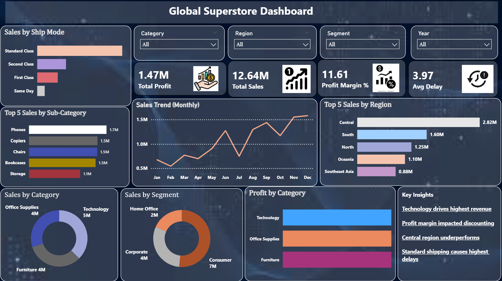

# Global Superstore End-to-End Analysis

## Objective
Analyze retail sales data to identify profit drivers, loss areas, and operational inefficiencies.

## Workflow

### 1. Data Cleaning & EDA
Performed data analysis using:
- Pandas → data cleaning, handling missing values, type conversion
- NumPy → numerical operations
- Matplotlib & Seaborn → data visualization

Key steps:
- Checked and fixed data types (dates, numeric columns)
- Handled missing values
- Identified outliers and anomalies
- Explored relationships between sales, profit, and discount

### 2. SQL Analysis
- Sales and profit aggregation
- Region-wise performance
- Loss-making products
- Customer analysis
- Shipping delay analysis

### 3. Power BI Dashboard
- KPI tracking (Sales, Profit, Margin, Delay)
- Region, Category, Segment analysis
- Monthly sales trends

## Key Insights
- High sales do not guarantee high profit (discount impact)
- Some regions underperform despite strong revenue
- Few products contribute majority of profit
- Standard shipping shows highest delays

## Dashboard Preview

## Tools Used
- SQL (MySQL)
- Power BI
- Excel / Python

## Project Structure
- /data → dataset
- /eda → cleaning & exploration
- /sql → queries
- /powerbi → dashboard
